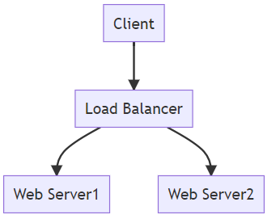
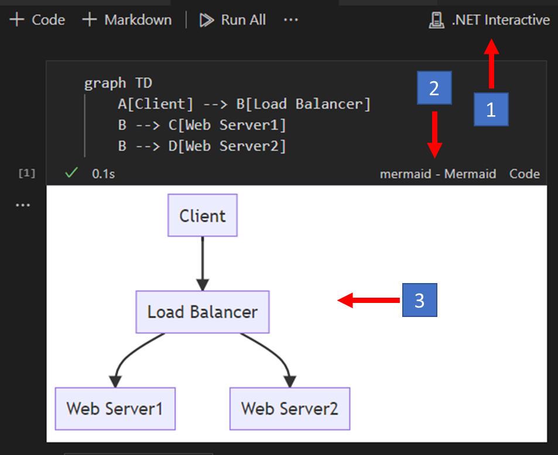

Many engineers underrate the power of a diagram, both in terms of conveying
their ideas and thoughts, and its ability to further your career.

Conveying your ideas and thinking is a critical skill for any engineer.

In this post, I'll show you how to use Mermaid to create diagrams in your Polyglot Interactive Notebooks.

```powershell
Connect-AzureRMAccount

# create a new resource group
New-AzureRmResourceGroup -Name MyResourceGroup -Location "Central US"

# display a list of resource groups, including the one you just created
Get-AzureRmResourceGroup
```

## Mermaid Syntax

Mermaid is a simple markdown-like syntax for generating charts from text via javascript. It is used to generate diagrams and flowcharts from text in a similar manner as markdown is used to generate html.

```
graph TD
    A[Client] --> B[Load Balancer]
    B --> C[Web Server1]
    B --> D[Web Server2]
```

*Generates:*



There are several was to see the output of your Mermaid code. You can use the [Mermaid Live Editor](https://mermaid-js.github.io/mermaid-live-editor/) to see the output of your Mermaid code. 

Here you see the Mermaid generated in an interactive notebook.



1️⃣ Ployglot Notebook Kernel<br>
2️⃣ Mermaid Language Server<br>
3️⃣ Mermaid Rendered Diagram<br>