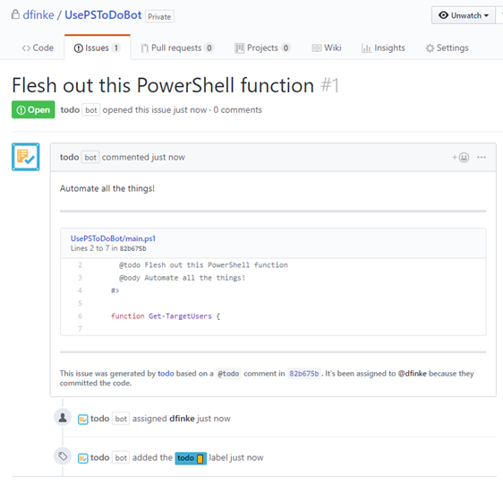

# Works with PowerShell

[todo](https://todo.jasonet.co/) is a GitHub App that automagically creates new issues based on comments and keywords in your code when you push it to GitHub.

<a href="https://github.com/apps/todo" class="btn btn-primary btn-large f3">Install <strong>todo</strong></a>

If you have a PowerShell repo, click on the link above to install it. It's pre-configured, ready to go and can be customized.

## In Action

Push this PowerShell script to your repo.

```powershell
<#
  @todo Flesh out this PowerShell function
  @body Automate all the things!
#>

function Get-TargetUsers {

}
```

**NOTE**: Block commenting is not required, you can use single line comments and the default configured keyword `@todo`

The `todo` bot then automatically generates a formatted issue in your repo, labeled, assigned, shows a snippet of code for context with a link back to the changed file.



## Automate the Tedium

Simply adding two comments to the PowerShell script you're working on generates all these great details, removing the friction to track things to follow up on.

Plus, it works on pull requests too!

Here's my [todo wired up repo](https://github.com/dfinke/UsePSToDoBot).