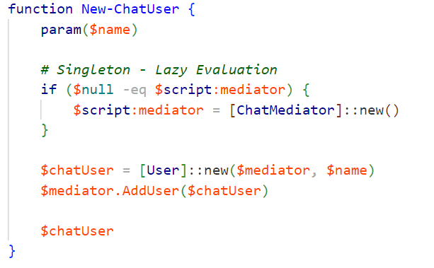

# Mediator Design Pattern in PowerShell  

The Mediator Design Pattern centralizes communication, reducing dependencies & improving maintainability. Instead of direct interactions, objects use a mediator. 

## Let's dive into the implementation! 

`ChatMediator Class`: Manages user interactions and message distribution. This class keeps track of users and handles sending messages to all users except the sender.

The ChatMediator class lets users send messages via the mediator instead of directly, simplifying interactions and decoupling architecture for better maintainability and scalability.

`User Class`: Represents participants in the chat. Users interact via the mediator, sending and receiving messages.

The User class represents a chat participant with a name and a mediator reference. Users send and receive messages through the mediator, avoiding direct interaction. 

This centralizes the communication, preventing direct user interaction.

`New-ChatUser Function`: Creates and registers new chat users using lazy initialization for the mediator.

The `New-ChatUser` function ensures the mediator is created only once (lazy evaluation) and adds the new user to the chat. This approach maintains a single mediator instance, centralizing communication.

`Example Usage`: Creating chat users and sending messages.

Here you see users sending messages, and we are removing a user.

This example demonstrates creating chat users, sending a message, removing a user from the chat, and sending another message. The ChatMediator ensures messages are only sent to active users.

The Mediator Design Pattern centralizes communication between objects, reducing direct dependencies and improving maintainability. It helps manage complex interactions in a decoupled and scalable manner.

## What We Did:
- ChatMediator: Managed interactions and message distribution
- User: Represented participants, handling messages via the mediator
- New-ChatUser: Created and registered users
- Example Usage: Showcased creating users, messaging, and user removal.

By implementing this pattern in PowerShell, we showcased how to structure communication in a way that simplifies interactions and enhances system maintainability. DesignPattern Mediator PowerShell

Here is the code for the PowerShell mediator pattern: 
https://gist.github.com/dfinke/c2615c4edc4df4886836153dd207815d