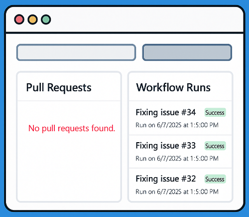
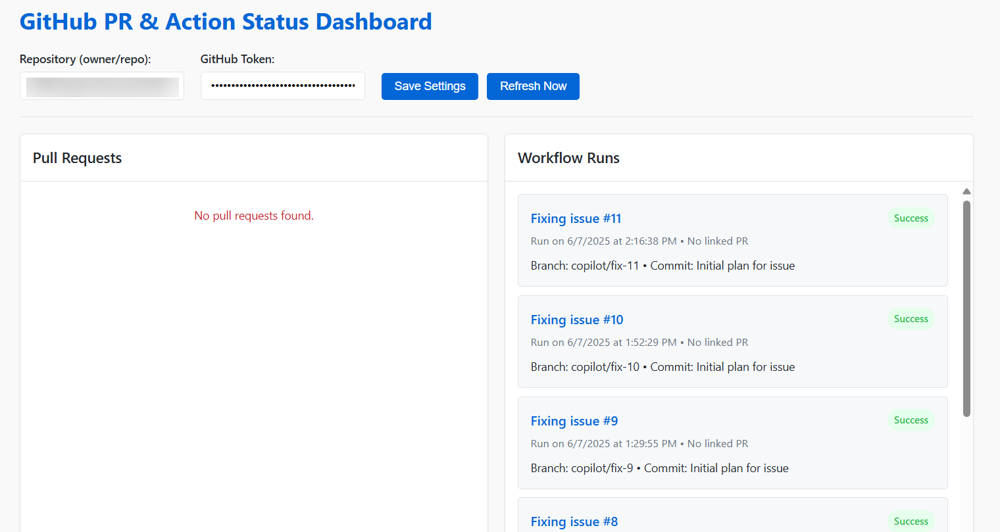

    

# One Idea, One Prompt — Watching GitHub Copilot Code Agent Work in Real Time

I’ve been experimenting with the new GitHub Copilot Code Agent. It’s early, but you can already feel where this is going.

The flow is straightforward:

1. I create a GitHub Issue describing a task.
2. I assign it to Copilot.
3. It creates a branch, opens a PR, and triggers a GitHub Action.

You can watch the work unfold, piece by piece. But here’s the thing:

**I had to keep flipping tabs.**
* One to check the PR
* Another to check the Actions tab
* Click, scroll, refresh
* Repeat

It felt like *exactly the kind of friction an agent is supposed to remove.*

## The Original Itch

So I had the idea: **I want a live dashboard.**
* One screen.
* On the left: PRs.
* On the right: Workflow runs.
* Updated every 15 seconds. No reloads. No tab switching.

That was part of the original itch—the vision of how this should feel. If we’re going to work with agents, we should have tools that *show the agency happening.*

## The Prompt

I didn’t overthink it. I spun up a completely separate project in VS Code, Copilot enabled.
Different repo, fresh folder. Just UI.

And I prompted:

> “Create an HTML dashboard that shows all open PRs and their GitHub Actions status. Refresh every 15 seconds.”

That was it.

## The Result

Copilot built the whole thing—HTML, JavaScript, CSS. Used the GitHub API.
I plugged in my repo name and a token, saved, and it ran.

And it just worked.

* PRs are listed on the left.
* Workflow runs on the right.
* Auto-refreshes every 15 seconds.
* I can see the agent’s progress in real time.

It’s not fancy. It’s not meant to be.

But it’s *exactly* what I wanted, and all from a single prompt. I didn’t write a line of code for the dashboard itself and it just works.

## The Shift

This is how things are changing:

* I didn’t build a dashboard. I had the idea and prompted for it.
* I didn’t wire up backend APIs. The agent did it.
* I didn’t switch contexts. I created one.

**From building to orchestrating. From tabs to tasks.**

The future of development isn’t just AI writing code—it’s reshaping how we *observe and direct* code being written. The dashboard I prompted into existence is as much about **visibility** as it is about **agency.**

And that’s the deeper shift.

## What’s Next?

* What if the dashboard had a button to reassign failed runs?
* What if it visualized issue threads as intent containers?
* What if it prompted *me* when something needed attention?

This is barely day one.

Agents aren’t just coding—they’re reshaping the workflows around code.
And we’re just getting started.

----
## Connect with Me

|Doug Finke||
| --- | --- |
| **X (Twitter)** | [@dfinke](https://twitter.com/dfinke) |
| **LinkedIn** | [linkedin.com/in/douglasfinke](https://www.linkedin.com/in/douglasfinke/) |
| **YouTube** | [youtube.com/@DougFinke](https://www.youtube.com/@DougFinke) |
| **GitHub** | [github.com/dfinke](https://github.com/dfinke) |
| **Blog** | [dfinke.github.io](https://dfinke.github.io) |